# CTi 华测食品农产品溯源系统 — 操作手册

> 版本：v1.0.0 | 更新日期：2026-07-06

---

## 一、系统概述

本系统是一套面向食品农产品行业的溯源管理平台，由**华测检测认证**运营，基于"一物一码"理念，实现从产地到餐桌的全链路追溯。

### 1.1 系统角色

| 角色 | 入口 | 说明 |
|------|------|------|
| **平台管理员** | `/admin` | 管理所有企业、产品、溯源码、模板等全局配置 |
| **企业用户** | `/enterprise` | 管理本企业商品、批次、订单、条码使用等日常业务 |
| **消费者（C端）** | `/trace/{溯源码}` | 扫码查看产品溯源信息，无需登录 |

### 1.2 访问地址

- 系统地址：`https://trace.cti-pit.com`
- 管理端：`https://trace.cti-pit.com/admin`
- 企业端：`https://trace.cti-pit.com/enterprise`
- 管理员账号：`admin`（密码由部署脚本生成，请向运维人员获取；首次登录后建议修改）

---

## 二、登录

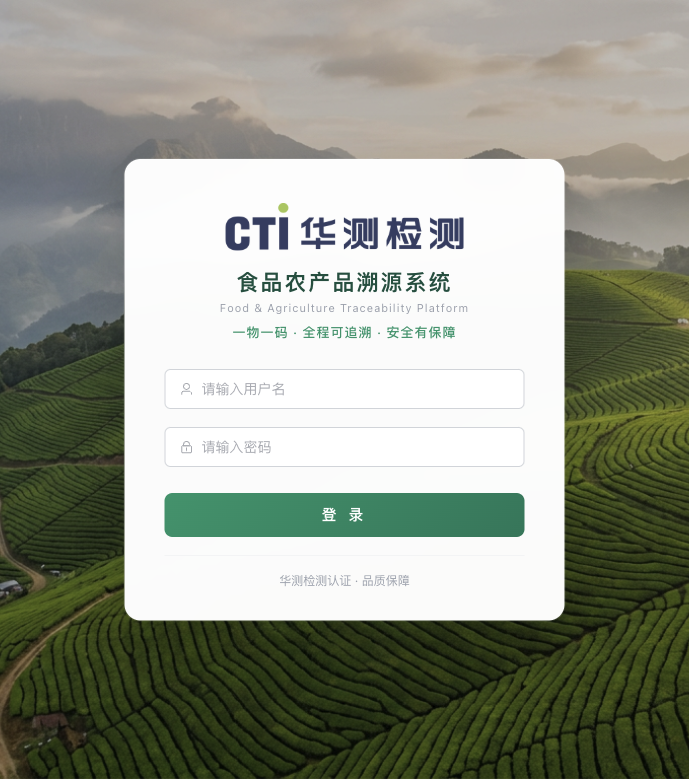

**操作步骤**：

1. 打开浏览器，访问 `https://trace.cti-pit.com`
2. 在登录页面输入**用户名**和**密码**（密码不少于 6 位）
3. 点击「登录」按钮
4. 系统自动识别角色并跳转：
   - 管理员 → 管理端控制台（`/admin`）
   - 企业用户 → 企业端控制台（`/enterprise`）

---

## 三、管理端操作指南

### 3.1 控制台（Dashboard）

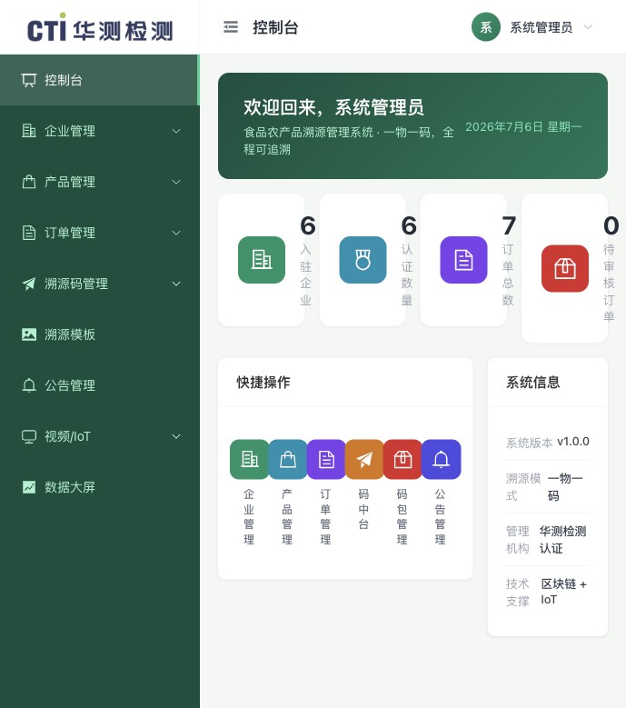

登录后进入管理端首页，展示系统核心指标：

- **统计卡片**：入驻企业数、认证数量、订单总数、待审核订单数
- **快捷入口**：一键跳转至常用功能模块
- **系统信息**：版本号、溯源模式（一物一码）、管理机构、技术支撑

### 3.2 企业管理

#### 3.2.1 企业列表

**路径**：左侧菜单 → 企业管理 → 企业列表

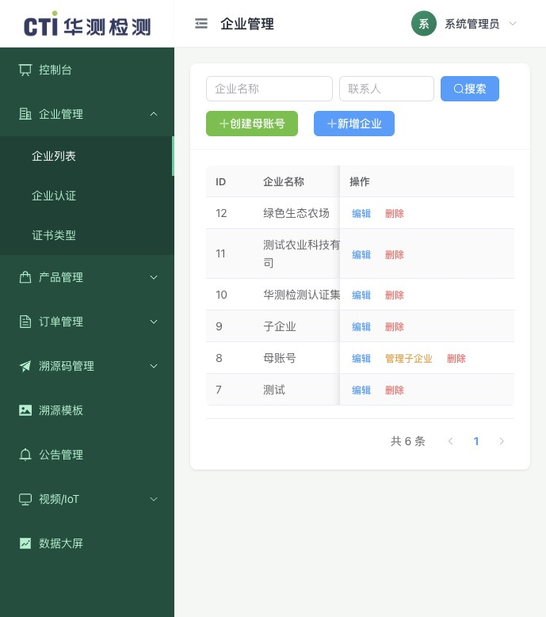

**操作步骤**：

| 操作 | 步骤 |
|------|------|
| **搜索** | 在顶部搜索框输入企业名称或联系人，点击搜索 |
| **新增企业** | ① 点击右上角「新增」按钮 → ② 填写企业表单（企业名称、性质、联系人、电话、登录账号/密码、信用代码、地址等）→ ③ 点击「确定」保存 |
| **编辑企业** | ① 在表格行点击「编辑」→ ② 修改表单信息 → ③ 点击「确定」 |
| **删除企业** | 点击表格行「删除」按钮，确认后删除 |
| **启用/禁用** | 切换表格中状态列的开关 |
| **创建母账号** | ① 点击「创建母账号」→ ② 填写母账号信息 → ③ 用于管理企业集团（母子账号体系） |

#### 3.2.2 企业认证

**路径**：左侧菜单 → 企业管理 → 企业认证

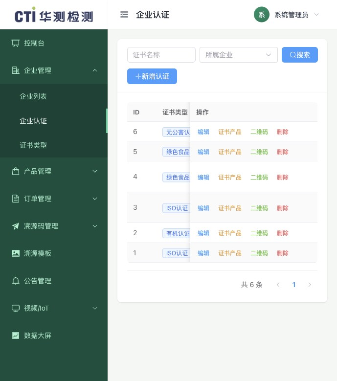

**操作步骤**：

1. **新增认证**：点击「新增」→ 选择证书类型（下拉）→ 选择所属企业 → 填写证书名称、产品名称 → 选择有效期起止日期 → 上传证书图片（支持多张）/ PDF 文件 → 点击「确定」
2. **证书产品管理**：点击「产品」按钮 → 查看/添加/移除关联产品 → 设置总产量（吨）
3. **查看二维码**：点击「二维码」按钮 → 查看/复制证书溯源二维码

> **注意**：上传了 PDF 时，证书图片不在溯源页展示（PDF 优先）。

#### 3.2.3 证书类型

**路径**：左侧菜单 → 企业管理 → 证书类型

管理证书分类字典（如有机认证、绿色食品认证、无公害认证等），支持新增/编辑/删除。

### 3.3 产品管理

#### 3.3.1 产品列表

**路径**：左侧菜单 → 产品管理 → 产品列表

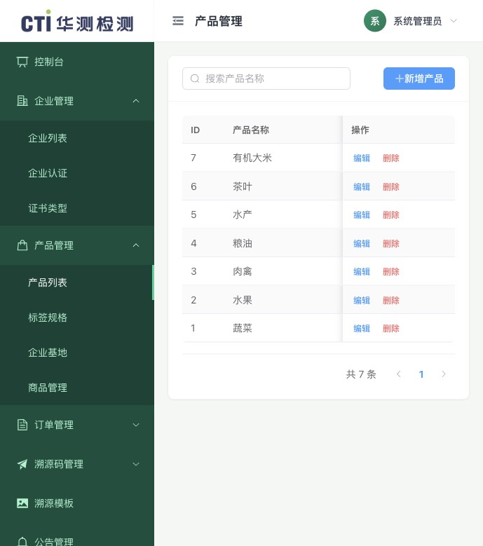

**操作步骤**：

1. **新增产品**：点击「新增」→ 填写产品名称（必填）→ 选择产品分类（谷物/蔬菜/水果/肉禽/水产/乳品/茶叶/其他）→ 填写编码和描述 → 点击「确定」
2. **编辑/删除**：在表格行操作

#### 3.3.2 标签规格

**路径**：左侧菜单 → 产品管理 → 标签规格

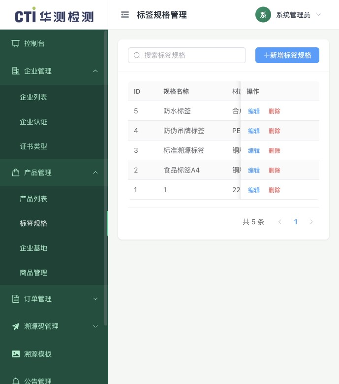

管理溯源码标签的物理规格。字段包括：规格名称（必填）、材质、单价（元）、使用方式（贴标/挂牌/喷码）、是否支持手动流水号、是否作废。

#### 3.3.3 企业基地

**路径**：左侧菜单 → 产品管理 → 企业基地

管理各企业的生产基地信息：基地名称、编号、所属企业、负责人、电话、面积/单位、地址、认证情况。

#### 3.3.4 商品管理（只读）

**路径**：左侧菜单 → 产品管理 → 商品管理

管理端为只读视图，可查看所有企业创建的商品详情（包装规格、重量、储存方式、食用方式、介绍），不可编辑。

### 3.4 订单管理

**路径**：左侧菜单 → 订单管理 → 订单列表

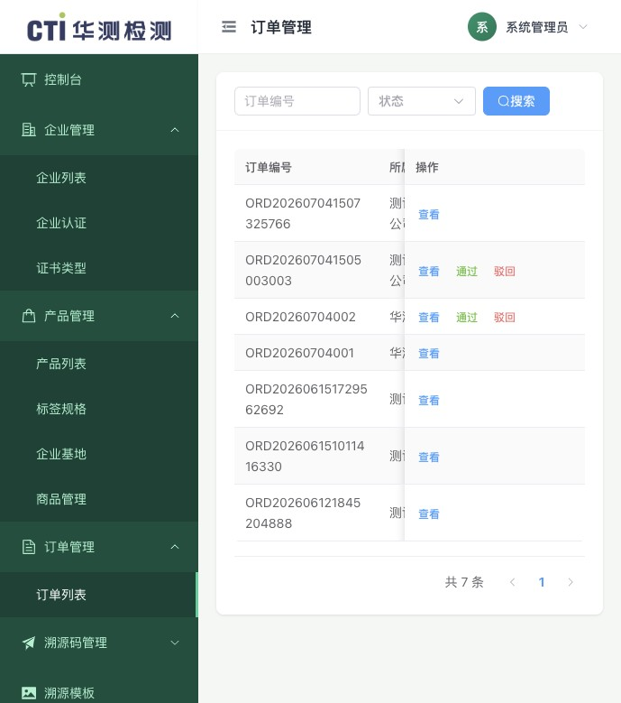

**操作步骤**：

| 操作 | 步骤 |
|------|------|
| **查看详情** | 点击「查看」按钮 → 查看订单条码、明细项、审核历史 |
| **通过审核** | 点击「通过」按钮 → 确认批准 |
| **驳回** | 点击「驳回」→ 填写驳回原因 → 确认 |

**订单状态流转**：企业创建（草稿）→ 提交审核（待审核）→ 管理端审核 → 已通过 / 已驳回

### 3.5 溯源码管理

#### 3.5.1 码中台 ⭐

**路径**：左侧菜单 → 溯源码管理 → 码中台

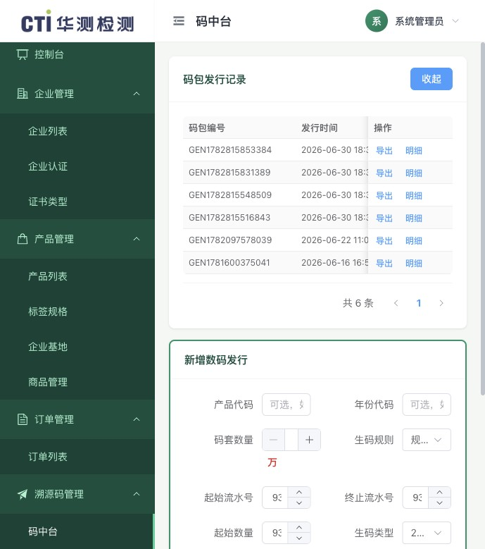

码中台是溯源码的**核心发行平台**，负责批量生成溯源码。

**发行溯源码步骤**：

1. 点击「新增数码发行」按钮
2. 填写发行参数：

| 字段 | 说明 |
|------|------|
| 产品代码 | 产品标识符 |
| 年份代码 | 年份标识 |
| 码套数量 | 生成码的数量（万为单位） |
| 生码规则 | A/B/C 三种规则，切换时自动调整流水号和防伪码位数 |
| 起始/终止流水号 | 流水号范围，支持点击「获取最后流水号」自动续接 |
| 生码类型 | 流水号+网址+防伪码 / 单防伪码 |
| 验证模式 | 输入验证 / 扫码即防伪 |
| 溯源码前缀URL | 溯源页面 URL 前缀 |

3. 点击「发行」→ 批量生成溯源码（>10万条时异步处理）
4. 可在码包记录中点击「导出」下载 CSV，或点击「明细」查看每条码详情

#### 3.5.2 码包管理

**路径**：左侧菜单 → 溯源码管理 → 码包管理

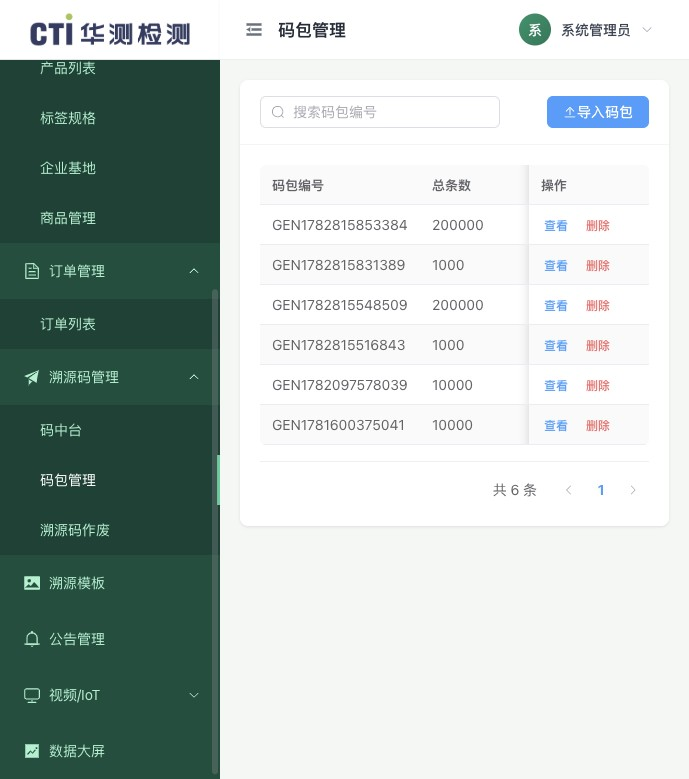

| 操作 | 步骤 |
|------|------|
| 导入码包 | 点击「导入」→ 上传 CSV/XLSX 文件 |
| 查看明细 | 点击「明细」→ 查看码包内每条码的流水号、防伪码、溯源网址、绑定状态 |
| 删除 | 仅未绑定状态的码包可删除 |

#### 3.5.3 溯源码作废

**路径**：左侧菜单 → 溯源码管理 → 溯源码作废

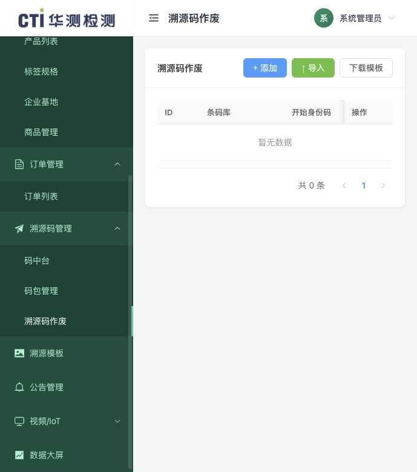

批量作废溯源码（标签损坏、批次取消等场景）：

1. **手动添加**：点击「添加作废码」→ 指定流水号位数、起始/结束身份码、备注
2. **Excel 导入**：下载模板 → 填写作废范围 → 批量导入

### 3.6 溯源模板管理

**路径**：左侧菜单 → 溯源模板

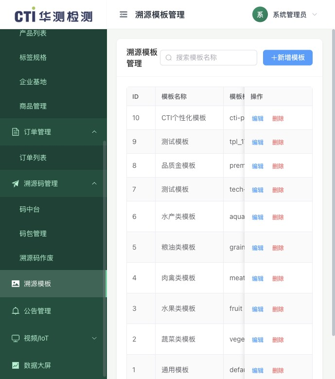

管理 C 端溯源页面的展示模板。

**操作步骤**：

1. **新增模板**：点击「新增」→ 填写模板名称、标识、类型
2. **编辑模板**：点击「编辑」→ 打开可视化编辑器 → 配置页面元素：
   - 基础元素：文本、富文本、图片、视频、分割线、按钮
   - 信息模块：企业认证、基地、产品、商品、检测报告
   - 高级元素：实时监控视频、IoT 传感器读数、温湿度曲线、运输车辆轨迹
3. **设置主题**：选择主题风格（标准绿 / 科技蓝 / 品质金）
4. **启用/禁用**：切换状态开关

### 3.7 公告管理

**路径**：左侧菜单 → 公告管理

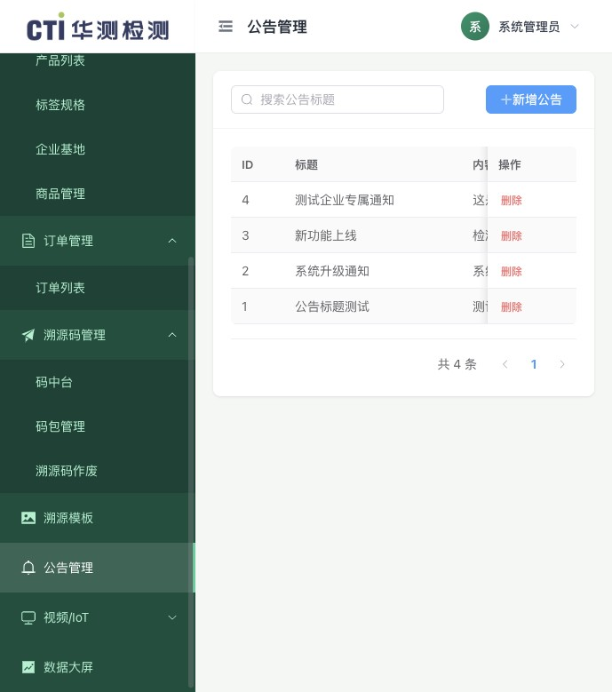

发布和管理系统公告，企业端可查看。支持新增公告（标题+内容）和删除。

### 3.8 视频/IoT

- **视频源总览**：查看全平台所有企业配置的视频源（只读表格）
- **IoT 设备总览**：查看全平台所有企业注册的 IoT 设备（只读表格）

### 3.9 数据大屏

**路径**：左侧菜单 → 数据大屏（独立全屏页面）

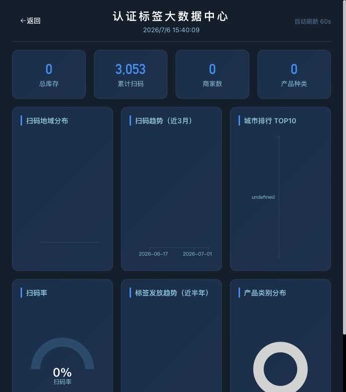

全局数据可视化大屏，展示扫码统计、地域分布、订单趋势、码发行量等宏观数据。

---

## 四、企业端操作指南

### 4.1 控制台（Dashboard）

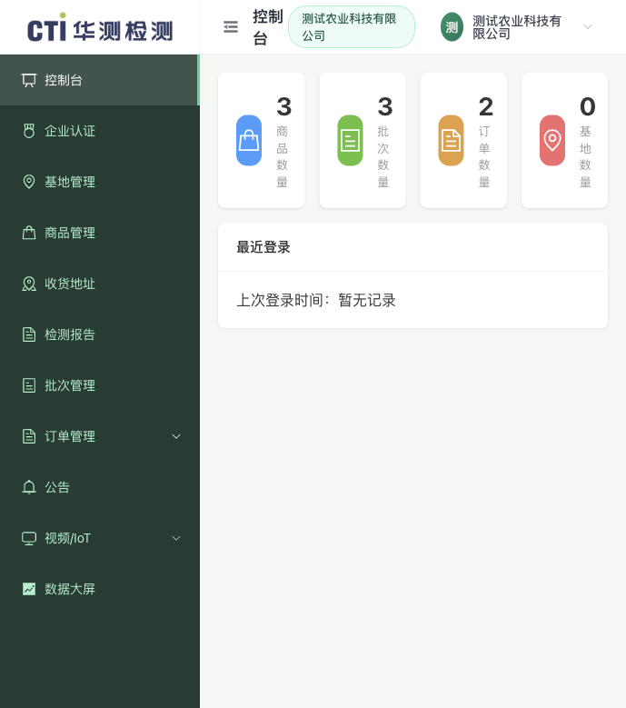

登录后进入企业端首页，展示本企业核心指标：

- **统计卡片**：商品数量、批次数量、订单数量、基地数量
- 母账号可在顶部下拉切换查看子企业数据或全部聚合数据

### 4.2 企业认证

**路径**：左侧菜单 → 企业认证

只读查看由管理端分配的认证信息（证书类型、名称、有效期、状态），企业不可自行新增或编辑。

### 4.3 基地管理

**路径**：左侧菜单 → 基地管理

查看和编辑由管理端创建的基地信息。可编辑：基地名称、负责人、联系电话、认证情况。不可新增/删除（由管理端统一管理）。

### 4.4 商品管理

**路径**：左侧菜单 → 商品管理

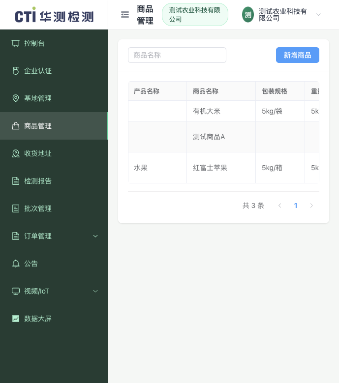

**操作步骤**：

1. **新增商品**：点击「新增」→ 选择产品（下拉选择已有产品）→ 填写商品名称（必填）、包装规格、重量规格、储存方式、食用方式、商品介绍 → 点击「确定」
2. **编辑/删除**：在表格行操作

### 4.5 收货地址

**路径**：左侧菜单 → 收货地址

管理订单收货地址（联系人、手机号、收货地址、邮编），支持新增/编辑/删除。

### 4.6 检测报告

**路径**：左侧菜单 → 检测报告

**操作步骤**：

1. 点击「新增」→ 填写报告名称（必填）、检测编号、检测机构、检测时间
2. 选择检测方式/依据/类型、检测结果（合格/不合格）
3. 上传报告图片（多张）/ PDF 文件
4. 点击「确定」保存

> PDF 优先展示——上传 PDF 后图片不在溯源页展示。

### 4.7 批次管理

**路径**：左侧菜单 → 批次管理

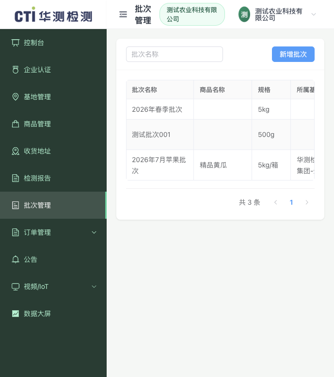

**操作步骤**：

1. **新增批次**：点击「新增」→ 填写批次名称（必填）→ 选择商品（下拉）→ 商品规格 → 选择基地（下拉）→ 选择检测报告（可选）→ 点击「确定」
2. **编辑**：修改批次信息
3. **查看二维码**：点击「二维码」→ 显示批次溯源二维码，消费者扫码可查看该批次溯源信息

### 4.8 订单管理

#### 4.8.1 订单列表

**路径**：左侧菜单 → 订单管理 → 订单列表

**操作步骤**：

1. **新增订单**：点击「新增」→ 选择关联证书（下拉）→ 选择收货地址 → 确认创建
2. **添加明细项**：进入订单详情 → 添加/编辑/删除订单项（选择商品、数量）
3. **提交审核**：草稿状态下点击「提交审核」→ 等待管理端审批
4. **删除**：仅草稿状态可删除

**状态流转**：草稿 → 待审核 → 已通过 / 已驳回

#### 4.8.2 订单条码

**路径**：左侧菜单 → 订单管理 → 订单条码

管理端审核通过后：
1. 点击「编辑」→ 选择溯源模板 → 设置条码数量 → 保存
2. 点击「预览码」→ 查看溯源二维码图片、溯源链接、流水号

#### 4.8.3 条码使用记录

**路径**：左侧菜单 → 订单管理 → 条码使用

记录条码的实际生产使用：
1. 点击「新增」→ 选择订单条码 → 填写开始/结束流水号、生产时间 → 保存

### 4.9 视频/IoT

#### 4.9.1 视频源管理

新增/编辑/删除视频监控源（名称、HLS/FLV/RTMP 流地址、关联基地/批次）。

#### 4.9.2 IoT 设备管理

注册/管理 IoT 设备：设备名称、类型（土壤传感器/温度传感器/GPS 追踪器/冷链监控）、设备编号、关联基地/批次。支持查看设备最新读数。

#### 4.9.3 IoT 告警

- **告警记录 Tab**：查看和处理告警（填写处理备注）
- **告警规则 Tab**：配置告警触发规则（设备、指标、阈值、条件）

### 4.10 数据大屏

**路径**：左侧菜单 → 数据大屏（独立全屏页面）

本企业数据可视化大屏。母账号可查看聚合数据或切换子企业。

---

## 五、消费者端（C端溯源）

### 5.1 扫码溯源

消费者扫描产品/批次上的溯源码二维码，自动跳转至溯源页面。

**访问方式**：
- **直接扫码**：`https://trace.cti-pit.com/trace/{溯源码编号}`
- **扫码即防伪**：`https://trace.cti-pit.com/?a={编号}&direct=1` — 显示防伪结果（✅正品 / ❌未找到）
- **批次溯源**：`https://trace.cti-pit.com/trace/batch/{批次ID}`

### 5.2 溯源页面示例

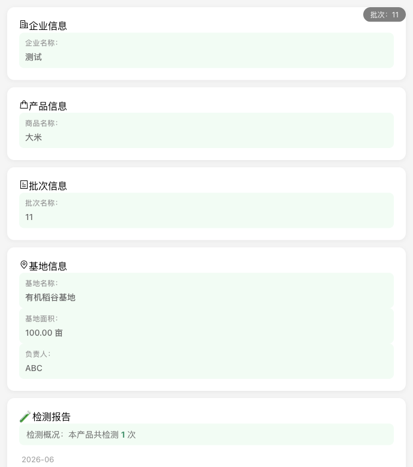

溯源页面根据管理端配置的**溯源模板**动态渲染，上图为一个批次溯源页面的示例，展示了：

- 企业信息（名称、认证标志）
- 产品信息（名称、分类、描述）
- 基地信息（名称、位置、面积）
- 检测报告（图片/PDF、检测结果）

**可能包含的其他模块**：

| 模块 | 说明 |
|------|------|
| 商品详情 | 包装规格、储存/食用方式 |
| 认证证书 | 证书图片/PDF、有效期 |
| 实时监控 | 视频监控画面（HLS 流播放） |
| 传感器数据 | IoT 传感器最新读数（温度、湿度、pH 等） |
| 温度曲线 | 温湿度历史折线图（支持 24h/7d/30d 切换） |
| 运输轨迹 | 腾讯地图展示车辆运输路线和实时位置 |

**主题风格**：标准绿、科技蓝、品质金（由模板配置决定）

---

## 六、核心业务流程

### 6.1 完整业务链路

```
① 管理端创建企业 → ② 管理端配置产品/基地/认证 → ③ 企业创建商品/批次
→ ④ 企业创建订单 → ⑤ 管理端审核通过 → ⑥ 管理端发行溯源码（码中台）
→ ⑦ 企业绑定条码到订单 → ⑧ 企业记录条码使用 → ⑨ 消费者扫码溯源
```

### 6.2 溯源码发行流程

1. 管理端 → 溯源码管理 → **码中台**
2. 点击「新增数码发行」，填写发行参数（产品代码、数量、规则、流水号范围）
3. 点击「发行」批量生成溯源码
4. 如需导出：点击「导出」下载 CSV
5. 码包自动出现在「码包管理」中

### 6.3 订单与条码流程

1. **企业端** → 订单管理 → 新增订单（选择证书和地址）
2. 在订单详情中添加订单项（商品、数量）
3. 提交审核（草稿 → 待审核）
4. **管理端** → 订单管理 → 审核通过
5. **管理端** → 订单详情 → 绑定码包到订单条码
6. **企业端** → 订单条码 → 选择模板、预览码
7. **企业端** → 条码使用 → 记录实际生产使用情况

### 6.4 溯源模板配置流程

1. **管理端** → 溯源模板 → 新增模板
2. 点击「编辑」进入可视化编辑器
3. 添加页面和元素（文本、图片、信息模块、视频、IoT 数据等）
4. 设置主题风格和排版
5. 保存并启用模板
6. 企业在订单条码中选择该模板 → 消费者扫码看到配置的溯源页面

---

## 七、常见问题

### Q1：企业忘记密码怎么办？
管理端 → 企业管理 → 找到对应企业 → 编辑 → 重新设置登录密码。

### Q2：溯源码生成后如何绑定到订单？
管理端 → 订单管理 → 找到已通过的订单 → 查看详情 → 在订单条码区域绑定码包。

### Q3：如何作废已发行的溯源码？
管理端 → 溯源码管理 → 溯源码作废 → 添加作废范围（手动或 Excel 导入）。

### Q4：消费者扫码显示什么内容由什么决定？
由**溯源模板**决定。管理端配置模板的页面元素和布局，企业在订单条码中选择模板。

### Q5：母账号和子账号的区别？
母账号是集团管理账号，可查看所有子企业数据并切换。子账号是独立企业账号，只能看到自己的数据。

### Q6：IoT 数据如何接入？
系统支持通过阿里云 IoT 平台 AMQP 消息消费自动接入数据，也内置了 Mock 数据生成器用于演示。实际对接需在 `application.yml` 中配置阿里云 IoT 参数。

---

## 八、技术架构

| 层级 | 技术 |
|------|------|
| 前端 | Vue 3 + TypeScript + Element Plus + Vite 5 |
| 后端 | Spring Boot 3.2 + Java 17 + MyBatis-Plus |
| 数据库 | MySQL 8.0 + Redis 7 + MongoDB 6 |
| 部署 | Nginx + Systemd + 阿里云 ECS |
| 溯源页面 | HLS 视频播放 + ECharts 图表 + 腾讯地图轨迹 |

---

*本手册由系统自动生成，如有疑问请联系系统管理员。*
